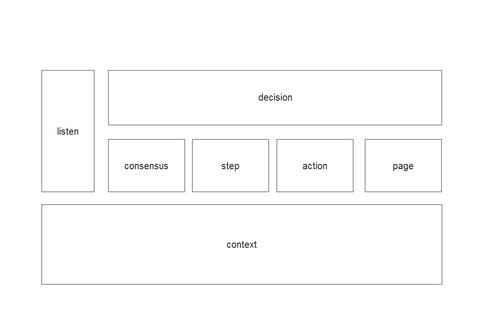

#行为驱动框架 - UI自动化

##什么是行为驱动开发(BDD)
"BDD" 全称 behavior-driven-development, "行为驱动开发"顾名思义是根据我们所要做事情来驱动我们开发过程. 行为驱动开发由3个词组成, 分别是"行为","驱动","开发". "驱动"和"开发"就是驱动开发过程意思, 但是"行为"是这种工作模式核心词, "行为"仅仅只是做什么事情意思吗? 其实不然, 他对行为有更高要求, 它要求测试, 开发, 或者其他人相关工作人员有统一行为, 我称之为"共识". 在拥有"共识"情况, 他们在工作中将以最小代价换取最高效率.

##为什么要行为驱动 - UI自动化
简简单单说什么好, 它永远不会被人认为是好的, 但是在某一"时刻"和"场景", 它比其他的好, 那么它就是最好的. 对比测试驱动开发(TDD)和行为驱动开发(BDD)之后, 选择可能就变得单一.
两种工作模式我都体验过, 我最开始工作使用测试驱动开发, 测试驱动开发概论就不再累述, 其核心就是"找到问题 - 开发完善 - 重构 - 找到问题 ..."一直循环的过程, 我觉得这种工作模式挺好, 利用最简单, 最快捷的方式来完成的UI自动化工作, 但是在运行过程中, 其他人是没法理解UI自动化在做些什么, 需要不断讲解整个过程, 最终结果报告也不合心意, 其他人很难明白测试报告意义. 但是我使用行为驱动开发之后, 我觉得在UI自动化领域, 使用行为驱动开发是最好工作模式. 开始会花费很多精力在"共识"之上, 我觉得很没有必要, 我甚至有放弃行为驱动想法. 之后我们开始开发, 发现开发过程很顺利, 当我们开发完成之后, 其他人会理解我们开发所有成果, 在运行过程中, 他们清楚明白所有UI自动化在做什么, 测试报告也能让所有人明白, 我也觉得这是最好测试报告, 因为它最适合我们团队.
在UI自动化领域, 它本身 
就结合业务, 更确切说它就是在描述业务. 业务会将与团队中所有人有关, 所以需要一个"共识". 

## UI行为驱动框架
我构建一款行为驱动框架, 希望能对大家UI自动化框架有所理解(采用cucumber中文写法, 如果有需要用英文或者java8可以联系我) 

###架构图 (./BDD-Framework.rp)

- consensus: BDD核心思想层, 采用cucumber
- step: 步骤直接实现
- action: 结合业务, 封装行为, 供step调用
- page: 页面原型描述
- context: 采用spring IOC/DI
- decision: 断言最终结果
- listen: 监听结果, 并通知观察者

 